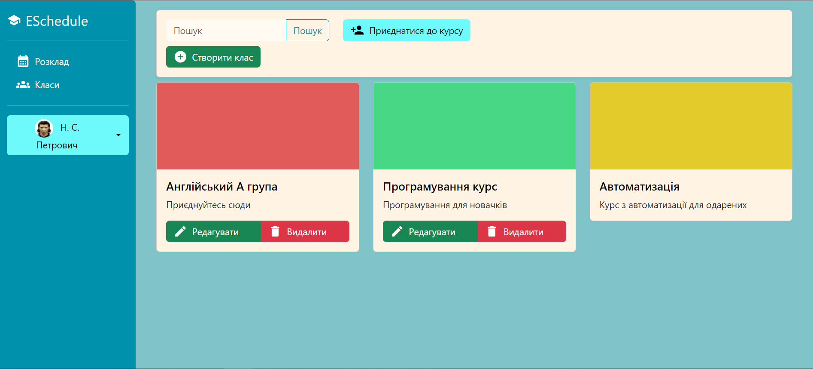

# ESchedule
A complex schedule service web site set on ASP.NET. There are several mechanics, such a classes, accounts, authentication, autorization and lessons. 
Technologies that i used in the project are: HTML, ASP.NET, Boostrap 5, Entity Framework Core, LINQ, Cookies authentication, LINQ, async, DI and etc.
Database is MS SQL Server.

